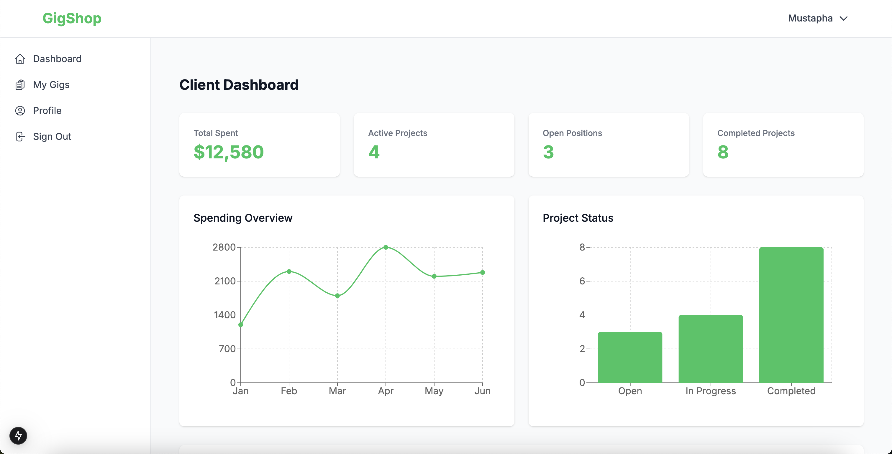
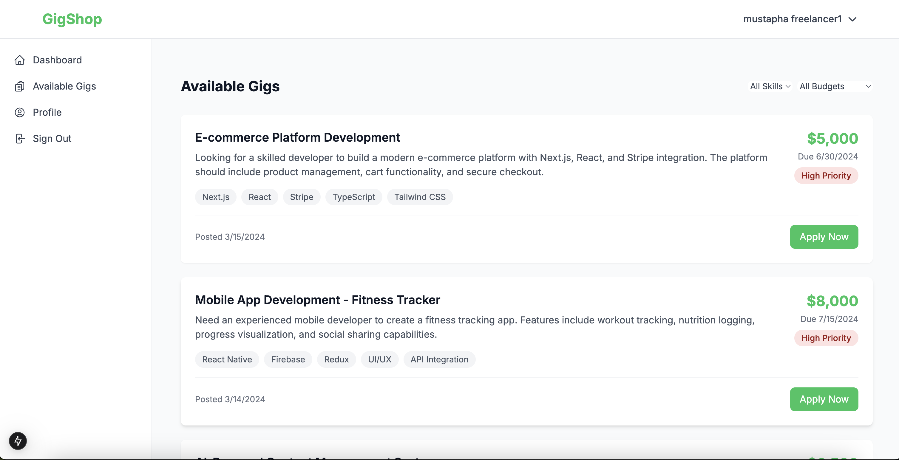

# GigShop

GigShop is a modern web application built with Next.js and Firebase that connects freelancers with clients. It provides a streamlined platform for posting jobs, managing projects, and handling freelance work.

## Dashboard Preview

*Client Dashboard showing spending analytics, project status, and recent gigs*

## Features

### For Clients (Job Posters)
- **Dashboard Overview**
  - Total spending metrics
  - Active projects tracking
  - Open positions monitoring
  - Project status visualization
  - Spending trends analysis
  
- **Gig Management**
  - Create and post new gigs
  - Track gig status and progress
  - View and manage applications
  - Complete project workflows

### For Freelancers
- **Dashboard Overview**
  - Total earnings tracking
  - Active gigs monitoring
  - Completed projects history
  - Client rating display
  - Status distribution charts
  
- **Gig Discovery**
  - Browse available gigs
  - Apply to open positions
  - Track application status
  - Manage ongoing projects


*Available gigs page showing job listings and application options*

### General Features
- **User Authentication**
  - Secure login and registration
  - Role-based access control
  - Protected routes
  
- **Real-time Updates**
  - Live status updates
  - Instant notifications
  - Real-time data synchronization

## Technology Stack

- **Frontend**
  - Next.js 13+ (App Router)
  - React
  - Tailwind CSS
  - Recharts for data visualization
  
- **Backend**
  - Firebase Authentication
  - Cloud Firestore
  - Firebase Security Rules
  
- **State Management**
  - React Context API
  - Custom hooks

## Getting Started

### Prerequisites
- Node.js 16.8 or later
- npm or yarn package manager
- Firebase account

### Installation

1. Clone the repository:
```bash
git clone https://github.com/mustaphaLounici/gigshop.git
cd gigshop
```

2. Install dependencies:
```bash
npm install
# or
yarn install
```

3. Set up environment variables:
Create a `.env.local` file in the root directory with your Firebase configuration:
```
NEXT_PUBLIC_FIREBASE_API_KEY=your_api_key
NEXT_PUBLIC_FIREBASE_AUTH_DOMAIN=your_auth_domain
NEXT_PUBLIC_FIREBASE_PROJECT_ID=your_project_id
NEXT_PUBLIC_FIREBASE_STORAGE_BUCKET=your_storage_bucket
NEXT_PUBLIC_FIREBASE_MESSAGING_SENDER_ID=your_messaging_sender_id
NEXT_PUBLIC_FIREBASE_APP_ID=your_app_id
```

4. Run the development server:
```bash
npm run dev
# or
yarn dev
```

5. Open [http://localhost:3000](http://localhost:3000) with your browser to see the result.

## Project Structure

```
src/
├── app/                    # Next.js 13 app directory
│   ├── (auth)/            # Authentication routes
│   └── (dashboard)/       # Protected dashboard routes
├── components/            # Reusable React components
├── hooks/                # Custom React hooks
├── lib/                  # Utility libraries and configurations
├── types/               # TypeScript type definitions
└── utils/               # Helper functions and utilities
```

## Authentication and Authorization

The application uses Firebase Authentication for user management and implements role-based access control:

- **Job Posters (Clients)**
  - Can create and manage gigs
  - Access to spending analytics
  - View applicant profiles

- **Freelancers**
  - Can view and apply to gigs
  - Access to earnings dashboard
  - Track ongoing projects

## Contributing

1. Fork the repository
2. Create your feature branch (`git checkout -b feature/AmazingFeature`)
3. Commit your changes (`git commit -m 'Add some AmazingFeature'`)
4. Push to the branch (`git push origin feature/AmazingFeature`)
5. Open a Pull Request

## License

This project is licensed under the MIT License - see the LICENSE file for details.

## Support

For contact, email Mustapha Lounici lounicimustapha6@gmail.com or open an issue in the GitHub repository.
